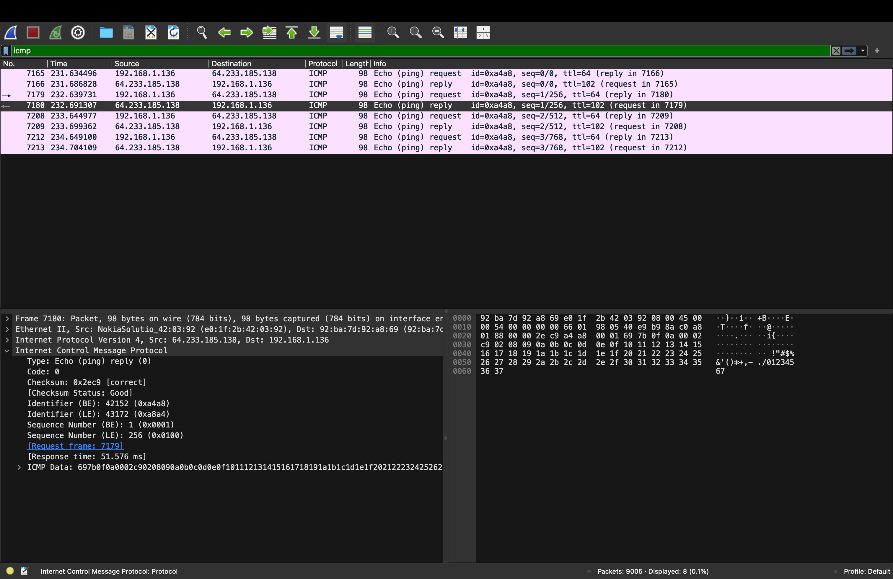
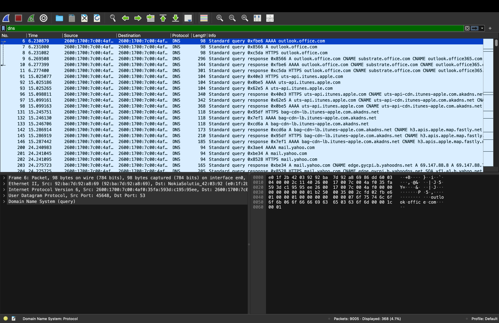
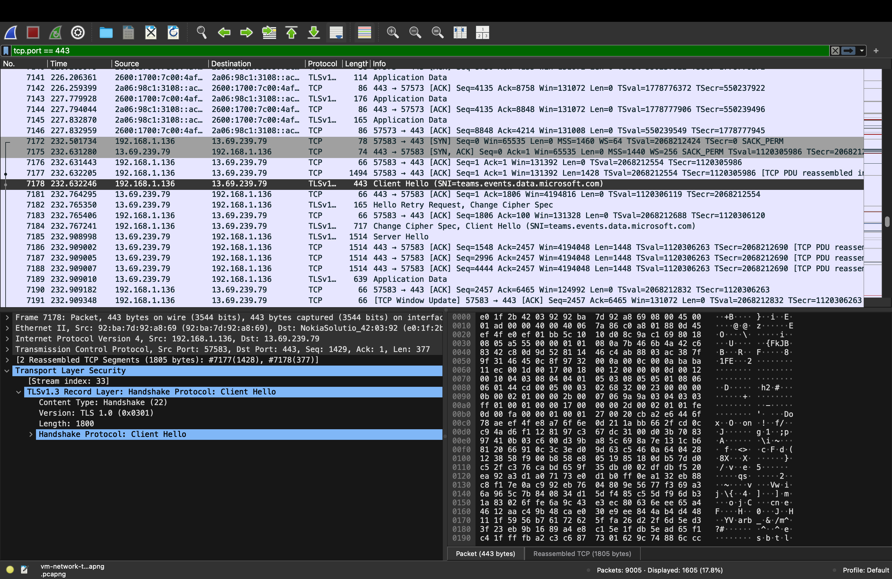

## Network Traffic Analysis with Wireshark

## Objective
Demonstrate understanding of modern encrypted network traffic by capturing and analyzing live network traffic using Wireshark.

## Environment
- Host OS: macOS (Apple Silicon)
- Capture Interface: Wi-Fi (en0)
- Network Analyzer: Wireshark
- Traffic Type: Live network traffic from host system
  
## Methodology
- Started a live packet capture using the Wi-Fi interface (en0)
- Generated normal network activity by accessing web services
- Applied protocol display filters in Wireshark
- Inspected DNS queries, ICMP traffic, and HTTPS/TLS handshakes
  
## Traffic Observed
- ICMP: Verified connectivity using echo requests and replies
  ### ICMP Echo Request / Reply Example

- DNS: Captured domain name resolution queries and responses
  ### DNS Query and Response Example

- HTTPS: Observed TLS handshakes and encrypted payloads
- ### HTTPS / TLS Handshake Example

## Key Insight
Modern web traffic is encrypted by default. While packet capture allows
visibility into metadata such as DNS queries and TLS handshakes, application
payloads remain protected. This project focuses on realistic defensive
visibility rather than bypassing encryption.

## Files
• Wireshark screenshots demonstrating ICMP, DNS, and TLS traffic analysis
• Documentation of observed network protocols and packet inspection

## Wireshark Filters Used
dns
icmp
tcp.port == 443
